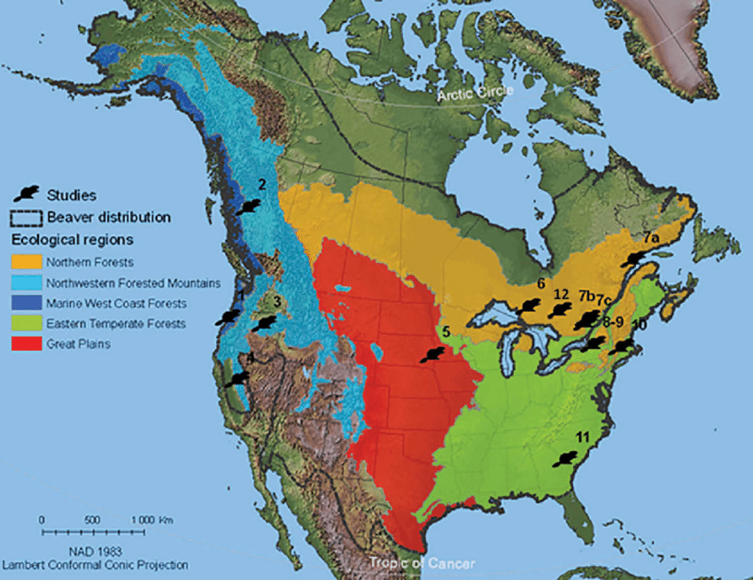

```{r setup, include=FALSE}
knitr::opts_chunk$set(echo = TRUE)
```

# INTRODUCCION

## Sobre Castor Canadensis

Es una especie de roedor castorimorfo de la familia _Castoridae_. Su habitat natural es en zonas próximas a lagos, lagunas y arroyos con acceso a recursos de construcción y alimento. El territorio donde se encuentra este roedor se extiende en Norteamérica, desde los bosques de Alaska y Canadá hasta el norte de México; además ha sido introducido en la Isla Grande de Tierra del Fuego, (Argentina, Chile), Finlandia y Rusia.




## Sobre la base de datos

Se va a hacer un análisis del conjunto de datos de R _*Beavers1*_

Cada conjunto de datos, compila la temperatura del cuerpo de dos castores hembras, cada 10 minutos por un período menor a un día en el estado de Wisconsin, Estados Unidos

### Resumen de la base de datos:

```{r beaver1, echo=FALSE}
knitr::kable(summary(beaver1)
             )
nrow(beaver1)
```

# ANALISIS DE DATOS

## Entender y preparar los datos

### Entender las variables

> day

La variable **day**, es el día en que se hizo la observación. Solo se observan dos días. Diciembre 12 = 346 y Diciembre 13 = 347.
Vamos a convertir esta base de datos en una serie de tiempo, dejando solo los datos de Diciembre 12

```{r unirtablas, echo=FALSE}
d_beaver1 <- beaver1[beaver1$day == 346, ]
```


> time

La variable **time** es una variable continua. Contiene la hora en que se tomó la muestra de temperatura. Esta en formato militar 0330, equivalente a 3:30


> temp

La variable **temp** esta en grados Celsius, estadarizada con la formúla:

\usepackage{gensymb}


$$ fahrenheit = celsius \times \frac{9}{5} + 32 $$

> activ

Esta es una variable binomial. Donde 0 = no tuvo actividad fuera del campo. Y 1 = tuvo actividad fuera del campo.

```{r activ, echo = FALSE}
table(d_beaver1$activ)
```


## Gráficos

La siguiente tabla muestra la temperatura de los castores a traves del día, para Diciembre 12 únicamente. 


```{r grap1, echo = FALSE}
n_beaver1 <- d_beaver1[d_beaver1$time > 500, ]
# hay un corte en la secuencia de los datos, entonces solo se usaron a partir de las 500h
plot(n_beaver1$time, n_beaver1$temp, type = "l", main = "Temp castores", xlab = "Hora", ylab = "Temp en C")
```


No se observa una tendencia contundente en la temperatura del cuerpo de los castores a traves del día. Esto resulta extraño, pues la periodicidad en la toma de muestra es de 10 minutos.

Según <https://es.weatherspark.com/> la temperatura ambiente promedio en Wisconsin, para el día 12 de Diciembre oscila entre 2 C y -4 C. 

Por motivos de este ejercicio, se va a generar una variable de temperatura del ambiente **temp_ambiente** con distribución $N(µ= -1, σ=1)$
Y se va a desorderar la variable **temp** para comparar las dos variables

```{r distri, echo = FALSE}
temp_ambiente <- rnorm(nrow(n_beaver1), -1, 1)
```

```{r graptemp, echo = FALSE}
set.seed(6543)
tempcastor <- sample(n_beaver1$temp)


plot(tempcastor, temp_ambiente, main = "Temp ambiente vs Temp castor")
abline(v = mean(n_beaver1$temp), col = "blue")
abline(h = -1, col = "red")

```

En este gráfico observamos que la temperatura del cuerpo del animal tiende a ser constante en la media.  

## Conclusiones

La base de datos estudiada no permite hacer mucha inferencia las caracteristicas del Castor Canadensis. Se puede decir a grandes rasgos, que para el día 12 de Diciembre de 1990, se tomó la temperatura a un ejemplar hembra Castor Canadensis en el estado de Wisconsin, Estados Unidos; y que este ejemplar mostró consistencia en la temperatura de su cuerpo. Se intuye, que los castores tienen mecanismos para equilibrar su temperatura corporal dependiendo a la temperatura ambiente.

